  <h1>Emir Hamurcu</h1>
  <h3>Robotics & AI & Maker | Software Developer</h3>
  
<em>"When you rest, you rust."</em>

  <table style="margin:10px auto 6px auto;">
    <tr>
      <td>
        
      </td>
      <td>
        
      </td>
    </tr>
    <tr>
      <td>
        
      </td>
      <td>
        
      </td>
    </tr>
  </table>

  

 

## WhoIsMrSentry

  <table bgcolor="#200009" style="margin:0 auto;border:1px solid #88001b;" cellspacing="0" cellpadding="6">
    <tr>
      <td>
        
      </td>
    </tr>
  </table>

## 👨‍💻 About

I'm **Emir Hamurcu** — robotics, embedded systems, and edge AI.

Based in **Hatay, Turkey** — I build systems that run on real hardware, under real constraints.

Focus: the **hardware–software boundary** (debuggable, measurable, deployable).

  
  
  
  
  

 

## 🚀 Tech Stack

**Languages**
 

 **Backend & Databases** 

 **AI & Computer Vision** 

 **Workflow & Version Control** 

 **Hardware & Tools** 

 

## 📊 Stats

  

 

## 🐍 Commit Snake

  <table bgcolor="#200009" style="margin:0 auto;border:1px solid #88001b;" cellspacing="0" cellpadding="6">
    <tr>
      <td>
        <!-- Visible after enabling the snake workflow -->
        
      </td>
    </tr>
  </table>

 

## 🔗 Links

  
  
  
  
  
   
  

 

<!-- Minimal copy, two-color theme (primary: #88001b, secondary: #000000). -->
   

 

