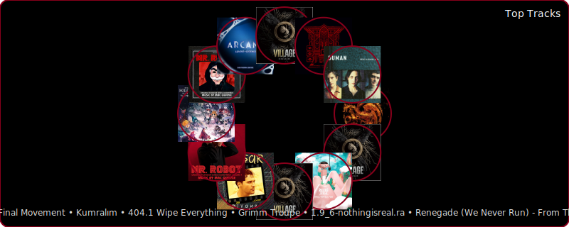
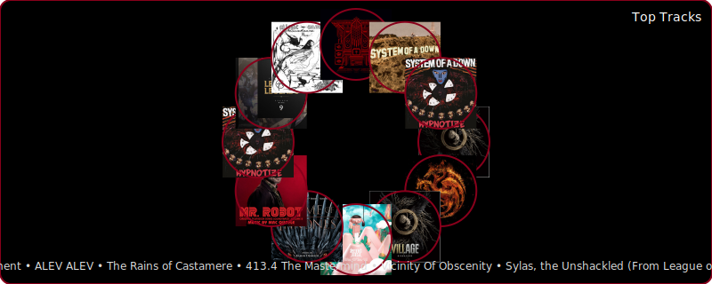
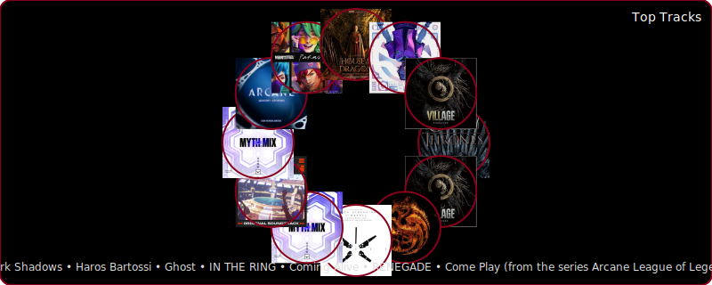

  <h1>Emir Hamurcu</h1>
  
AI • Robotics • Reverse Engineering

  

 

## Now Playing

  <!-- Update UID if needed, then grant permission at https://spotify-github-profile.kittinanx.com/api/login -->
  

 

<!-- SPOTIFY_CURRENT_PLAYLIST:START -->

Not playing right now.

<!-- SPOTIFY_CURRENT_PLAYLIST:END -->

 

## Recently Played (scroll)

<!-- SPOTIFY_RECENTS:START -->

<!-- SPOTIFY_RECENTS:END -->

 

## Focus

- AI, robotics, embedded systems
- Computer vision, control, reverse engineering

 

## Top of the Week

<!-- SPOTIFY_TOP_OF_WEEK:START -->

<strong>Haros Bartossi</strong>

Christopher Nas

<!-- SPOTIFY_TOP_OF_WEEK:END -->

 

## Top Tracks

  
    Mode:
    <a href="#top-short">Short</a> ·
    <a href="#top-mid">Mid</a> ·
    <a href="#top-long">Long</a>
  
   

  

 

  

 

  

 

## Tech Stack

 

## Stats

  
  

 

## Commit Snake

  <!-- Will show after enabling the snake workflow -->
  

## Links

  
  
  
  
  

 

  

<!-- Minimal English copy, two-color theme (primary: #88001b, secondary: #000000). -->
   

 
