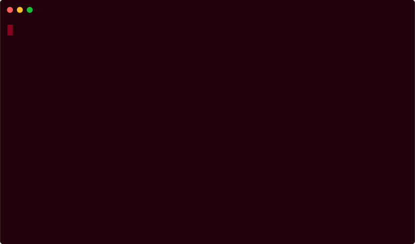

    

 

 

  <h1>Emir Hamurcu</h1>
  <h3>Robotics & Embedded AI Enthusiast • Software Developer • Maker</h3>
  
Curious builder exploring Edge AI, Embedded Systems, and Computer Vision

  
<em>"When you rest, you rust."</em>

 

  

    

      
      
      
      
    

    

      
      
      
      
    

    

      
    

    

      
    

  

 

## 🚀 Tech Stack

### Languages

  

### Frontend

  

### Backend & Database

  
  

### AI & Computer Vision

  
  
  
  
  
  

### Workflow

  

### Tooling, Data & Robotics

  
  
  
  
  
  
  
  
  
  
  

### Hardware & Embedded

  
  
  
  
  

 

## 📊 Stats

  
  

  

  

 

## 🐍 Commit Snake

  <table bgcolor="#200009" style="margin:0 auto;border:1px solid #88001b;" cellspacing="0" cellpadding="6">
    <tr>
      <td>
        <!-- Visible after enabling the snake workflow -->
        
      </td>
    </tr>
  </table>

 

<table align="center" style="margin:16px auto;border-collapse:collapse;">
  <tr>
    <td align="center" style="padding:0 10px;">
      <table align="center" style="margin:0 auto;border-collapse:collapse;">
        <tr>
          <td align="center" style="padding:0;">
            
          </td>
        </tr>
        <tr>
          <td align="center" style="padding:0;">
            
          </td>
        </tr>
      </table>
    </td>
    <td align="center" style="padding:0 10px;">
      <table align="center" style="margin:0 auto;border-collapse:collapse;">
        <tr>
          <td align="center" style="padding:0;">
            
          </td>
        </tr>
        <tr>
          <td align="center" style="padding:0;">
            
          </td>
        </tr>
      </table>
    </td>
  </tr>
</table>

 

<!-- Minimal copy, two-color theme (primary: #88001b, secondary: #000000). -->
   

 
